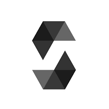
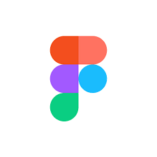

## Hey 👋, I'm [Jeremiah Oyeniran](https://github.com/jerydam/)

### Glad to see you here! &nbsp; 

I earned a Diploma in Computer Engineering 🎓 from The polytechnoic, Ibadan 🏛. I'm a passionate learner who's always willing to learn and work across technologies and domains 💡. I love to explore new technologies and leverage them to solve real-life problems ✨. I'm currently into Web Development 🕸️ and working on Becoming a fullstack Blockchain Developer🤓.

Joined Github **5** years ago.

Like My Work?

### Talking about Personal Stuffs:

- 🛠 &nbsp; I’m currently working with Solidity, Hardhat, Diamond Standard,   Foundry, Reactjs, Javascript, Rust, Leo etc.
- 🚀 &nbsp; I’m currently learning Full Stack Development.
- 👨🏻‍💻 &nbsp; Most of my projects are available on [Github](https://github.com/jerydam).
- 💬 &nbsp; Ask me about anything [here](https://github.com/jerydam/AboutMe)! I am happy to help.
- 👾 &nbsp; Fun fact: Equal is Not Always Equal in Javascript.
- 📫 &nbsp; How to reach me: jerydan148@gmail.com.
- 📝 &nbsp; Checkout my [Resume](https://github.com/jerydam/AboutMe/blob/master/resumee.pdf).
- 💬 &nbsp; Chat me up on Whatsapp [here](https://wa.me/message/RQCQJ3FITTOVA1)! I am always Available.

### My Absolute Favorites:

- 💻 &nbsp; I love exploring new tech stack and building cool stuffs.
- 📰 &nbsp; Touring new places & writing tech blogs whenever possible.
- 🍕 &nbsp; Hackathons, meetups & tech events.

### Languages and Tools:

 solidity
 tailwind css
 wordpress
 figma
terminal

 sass
&nbsp;
&nbsp;
&nbsp;
&nbsp;

&nbsp;
&nbsp;
&nbsp;
&nbsp;

&nbsp;

#### I have good experience in

- NFT.
- Vault, Lottery, Farm, Trading Contracts.
- UniswapV2 & V3, Chainlink.
- Smart contracts.

|  |  |
| ---------------------------------------------------------------------------------------------------------------------------------------------------------------------------------------------------------------------------------------------------- | ---------------------------------------------------------------------------------------------------------------------------------------------------------------------------------------------------------- |

### Show some ❤️ by starring some of the repositories!

